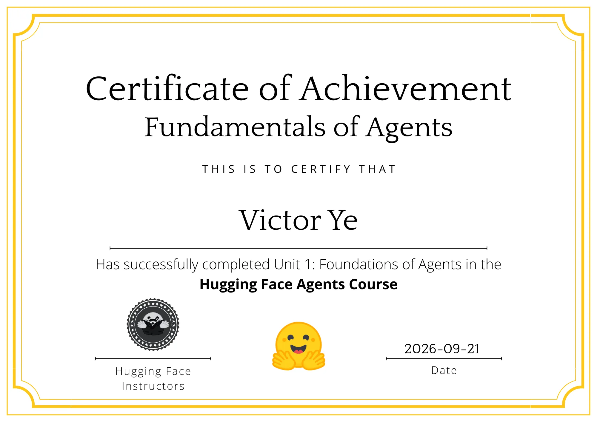

# Hugging Face Agents Course

Implémentations personnelles, expérimentations et notes réalisées dans le cadre du
[Hugging Face Agents Course](https://huggingface.co/learn/agents-course).

## Objectifs

Ce dépôt documente mon travail pratique pendant mon apprentissage de la conception, de l’utilisation et de l’évaluation d’agents IA.

Les sujets abordés incluent :

* Fondamentaux des agents IA
* Utilisation d’outils et appel de fonctions
* smolagents
* LlamaIndex
* LangGraph
* RAG agentique
* Évaluation des agents
* Benchmark GAIA

## Progression

- [x] Unit 0 — Onboarding
- [x] Unit 1 — Fondamentaux des agents
- [ ] Unit 2 — Frameworks
- [ ] Unit 3 — Agentic RAG
- [ ] Final Project — GAIA

## Structure du dépôt

* `unit-1-fundamentals/` — Fondamentaux des agents et premières expérimentations
* `unit-2-frameworks/` — Expérimentations avec différents frameworks d’agents
* `unit-3-agentic-rag/` — Implémentations de RAG agentique
* `final-project/` — Projet final et évaluation
* `docs/` — Modèles et documentation générale

## Cours

Cours officiel :
https://huggingface.co/learn/agents-course

Dépôt officiel :
https://github.com/huggingface/agents-course

## Certificat

Certificat obtenu après avoir terminé l’Unité 1 — Fondamentaux des agents du Hugging Face Agents Course.

