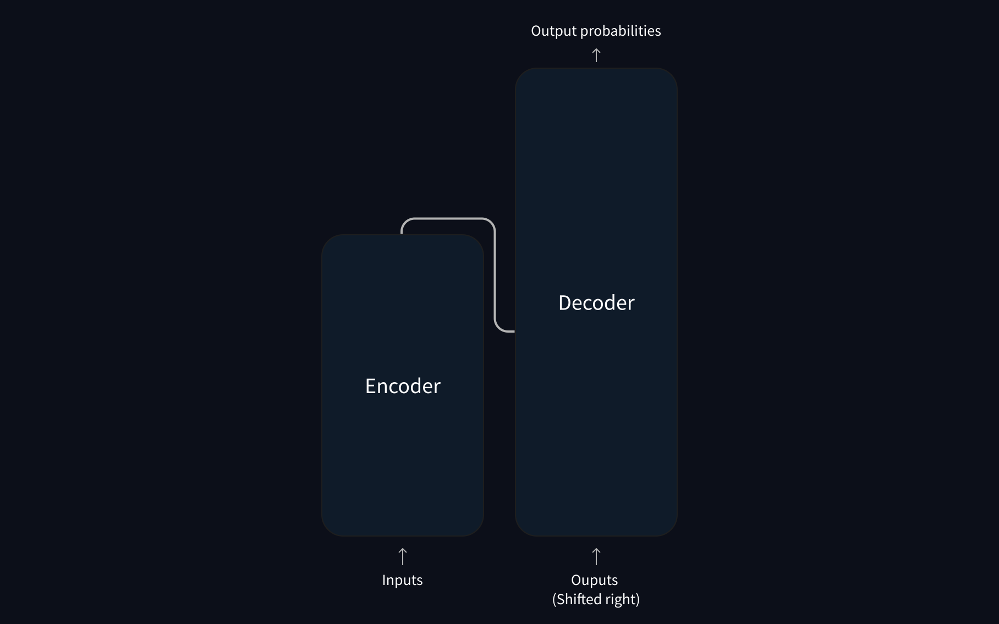
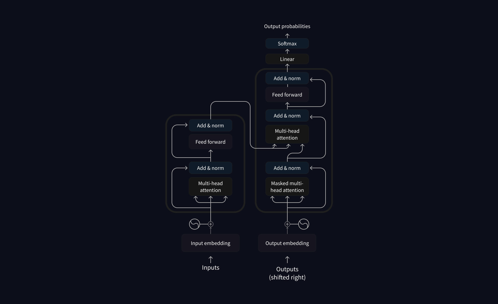

Comment fonctionnent les *transformers*?
> Source : [Hugging Face LLM Course — How do Transformers work?](https://huggingface.co/learn/llm-course/fr/chapter1/4)

Trois catégories de modèles:
* type GPT (transformers autorégressifs)
* type BERT (transformers auto-encodeurs)
* type BART/T5 (transformers séquence-à-séquence)

# Les *transformers* sont des modèles de langage

Tous les types de modèles mentionnés ci-dessus sont des modèles qui ont été entraînés sur une large quantité de textes bruts de manière autosupervisée.

L'apprentissage autosupervisé calcule l'objectif à partir des entrées du modèle, donc l'intervention de l'humain n'est pas nécessaire pour étiqueter les données.

Ces modèles, une fois entraînés, n'ont qu'une compréhension statique de la langue. Ils ne sont pas directement adaptés à des tâches spécifiques.

Pour leur permettre d'acquérir cette capacité de résolution de problèmes pratiques, ils passent par l'apprentissage par transfert durant lequel ils sont *fine-tunés* de manière supervisée (en utilisant des étiquettes annotées par des humains) pour une tâche donnée.

## Les *transformers* sont énormes

La stratégie pour obtenir de meilleures performances consiste à augmenter la taille des modèles ainsi que la quantité de données utilisées pour l'entraînement de ces derniers.

Ce besoin en grande quantité de données et de ressources de calcul se traduit par un impact environnemental.

Pour y remédier, on peut partager les poids d'entraînement de nos modèles pour pouvoir éviter de repartir de 0 à chaque fois.

## L'apprentissage par transfert

Le pré-entraînement entraîne le modèle de zéro: les poids sont initialisés de manière aléatoire et l'entraînement commence sans aucune connaissance préalable.

Ce pré-entraînement nécessite de très grands corpus de données et énormément de temps.

Le *fine-tuning* est l'entraînement effectué après le pré-entraînement. On entraîne le modèle de langue pré-entraîné sur un jeu de données spécifique.

Pourquoi ne pas directement entraîner le modèle sur ces données spécifiques ?
* Le modèle pré-entraîné permet une meilleure compréhension (statistique) des données spécifiques
* Réduit le besoin de données pour obtenir des bons résultats
* Réduit le temps et les ressources nécessaires

Le *fine-tuning* permet d'itérer sur différents schémas de *fine-tuning* grâce à ses avantages cités ci-dessus.

Pour ces raisons, il est souvent préférable de *fine-tuner* un modèle pré-entraîné plutôt que d'en entraîner un nouveau à partir de zéro, ce qui nécessite généralement une grande quantité de données.

## Architecture générale

### Introduction

Le modèle est principalement composé de deux blocs:
* **Encodeur**: reçoit une entrée et construit une représentation de celle-ci (ses caractéristiques). Le modèle est optimisé pour acquérir une compréhension venant de ces entrées.
* **Décodeur**: utilise la représentation de l'encodeur (les caractéristiques) en plus des autres entrées pour générer une séquence cible. Le modèle est optimisé pour générer des sorties.

Les blocs peuvent être utilisés indépendamment en fonction de la tâche traitée:
* Modèles encodeurs: tâche nécessitant une compréhension de l'entrée (classification, reconnaissance d'entités nommées)
* Modèles décodeurs: tâche générative (génération de texte)
* Modèles encodeurs-décodeurs (modèles séquence-à-séquence): tâche générative qui nécessite une entrée (traduction, résumé de texte)

### Les couches d'attention

Cette couche indique au modèle de prêter une attention spécifique à certains mots de la phrase fournie (et d'ignorer plus ou moins les autres) lors du traitement de la représentation de chaque mot.

Le modèle prête alors une attention particulière aux mots qui pourraient apparaître plus loin dans l'entrée fournie pour réaliser la tâche demandée.

### L'architecture originale

L'architecture du *transformer* a initialement été construite pour la tâche de traduction. Pendant l'entraînement, l'encodeur reçoit la séquence dans la langue source et le décodeur reçoit la séquence cible décalée d'une position vers la droite (un token de début est ajouté) afin de prédire le token suivant à chaque position.

Pour accélérer l'apprentissage (lorsque le modèle a accès aux sorties cibles), le décodeur est alimenté avec la cible entière, mais il n'a que le droit d'accéder aux positions précédentes.

L'architecture originale du *transformer*:

La première couche d'attention du décodeur prête attention à toutes les entrées passées du décodeur, mais la seconde utilise la sortie de l'encodeur. Ça permet d'obtenir l'ensemble de la phrase d'entrée pour mieux prédire le prochain mot et d'avoir le contexte et de tenir compte de la grammaire et de l'ordre des mots selon la langue cible

*Le masque d'attention* peut être utilisé pour empêcher le modèle de prêter attention à certains mots spéciaux. Par exemple, le mot de remplissage (*padding*) pour que toutes les entrées aient la même longueur lors du regroupement de phrases.

### Architectures contre *checkpoints*

Architecture: c'est le squelette du modèle, définition de chaque couche et de chaque opération qui se produit au sein du modèle
Checkpoints: poids qui sont chargés dans une architecture donnée
Modèle: c'est un mot valise n'étant pas aussi précis que `architecture` ou `checkpoint`
