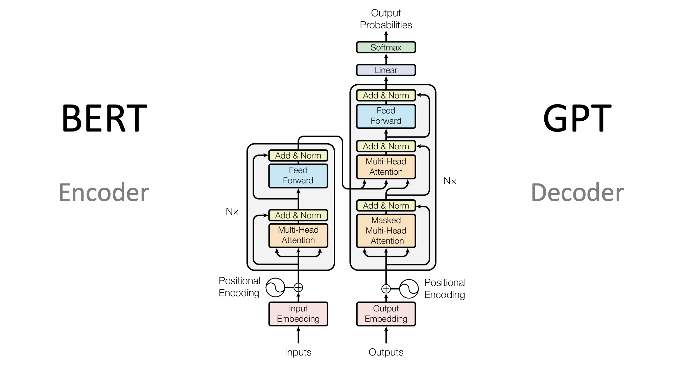
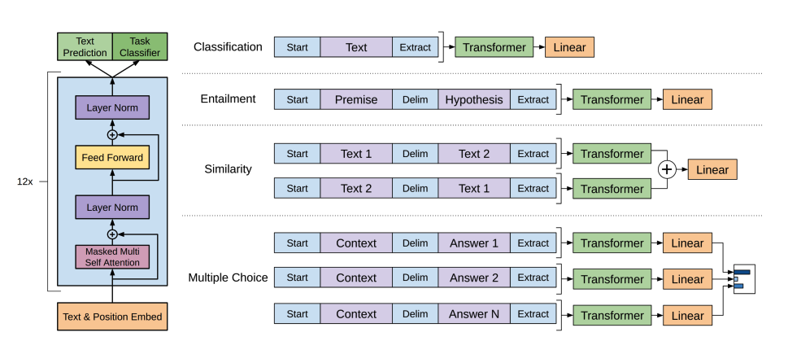
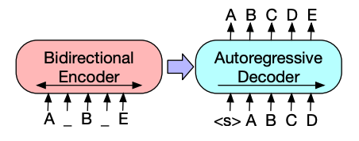
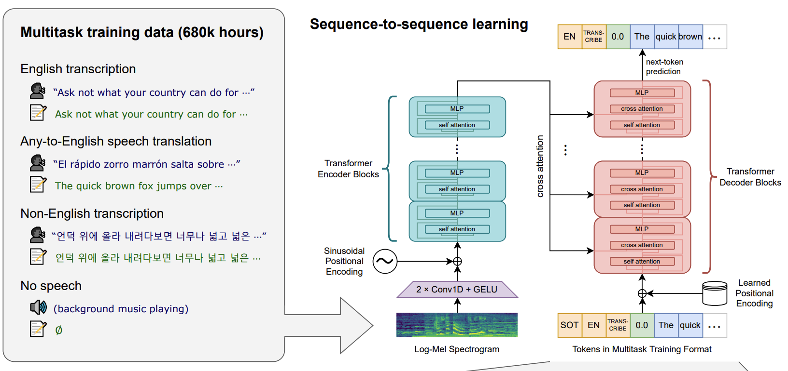
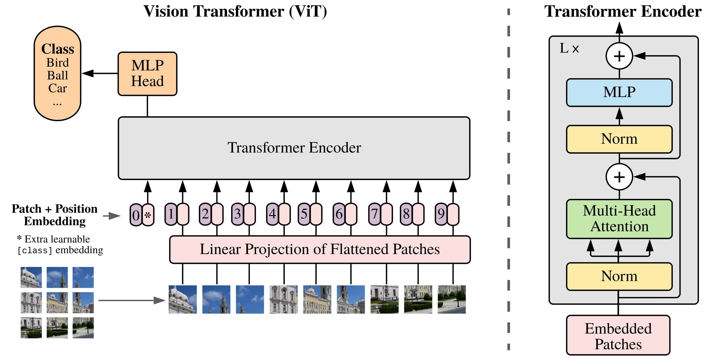

# Comment les *transformers* résolvent les tâches ?
> Source : [Hugging Face LLM Course — How Transformers solve tasks](https://huggingface.co/learn/llm-course/en/chapter1/5)

Dans [Que peuvent faire les *transformers* ?](./02-que-peuvent-faire-les-transformers.md), on a découvert le NLP et les tâches qu'ils peuvent résoudre telles que des tâches de vision par ordinateur, de reconnaissance vocale et audio et leurs applications.

Il existe plusieurs manières de résoudre ces problèmes, la résolution peut être différente selon le modèle et la stratégie adoptée, mais pour les modèles *transformers*, l'idée générale ne change pas.

Grâce à leur architecture flexible, la plupart des modèles sont des variantes des structures encodeur, décodeur ou encodeur-décodeur.

> Avant de voir les différentes variantes d'architecture, il est important de comprendre que la résolution de problèmes se fait généralement de la même manière : les données en entrée sont traitées par un modèle et la sortie est interprétée par rapport au problème. Les différences dépendent de comment les données sont préparées, quelle variante de modèle est utilisée et de comment la sortie est interprétée.

## Modèles *transformer* pour le langage

Les modèles de langage sont au cœur du NLP moderne. Ils permettent de comprendre et de générer du langage humain à partir de l'apprentissage des motifs statistiques et des relations entre mots ou tokens du texte.

Le Transformer a été initialement conçu pour la traduction machine mais depuis il est devenu l'architecture par défaut pour résoudre toutes les tâches d'IA. Certaines tâches dépendent de la structure encodeur, d'autres de la structure décodeur et d'autres de la structure encodeur-décodeur.

## Comment les modèles de langage fonctionnent

Les modèles de langage fonctionnent grâce à leur entraînement sur la prédiction de la probabilité d'un mot donné par rapport aux mots qui l'entourent. Ce qui leur permet d'obtenir une compréhension de base du langage qui pourra être généralisée aux autres tâches.

Deux approches d'entraînement :
* Modélisation par langage masqué (Masked language modeling (MLM)) : utilisée par des encodeurs comme BERT, cette approche cache aléatoirement des tokens de l'entrée et entraîne le modèle à prédire le token d'origine en s'appuyant sur les mots qui l'entourent. Ce qui permet au modèle d'apprendre le contexte bidirectionnel (regarde les mots avant et après le mot masqué).
* Modélisation causale du langage (Causal language modeling (CLM)) : utilisée par des décodeurs comme GPT, cette approche prédit le prochain token par rapport aux tokens passés de la séquence. Le modèle ne peut qu'utiliser le contexte de gauche (tokens d'avant) pour prédire le prochain token.

## Types de modèles de langage

Dans la bibliothèque Transformers, la plupart des modèles suivent trois types d'architecture :
1. Modèle à encodeur uniquement (Encoder-only models (like BERT)) : Ces modèles analysent le contexte avec une approche bidirectionnelle. Ils sont adaptés aux tâches qui nécessitent une compréhension approfondie du texte, comme la classification, la reconnaissance d'entités nommées et la réponse aux questions.
2. Modèle à décodeur uniquement (Decoder-only models (like GPT, Llama)) : Ces modèles traitent le texte de gauche à droite et sont bons pour les tâches de génération de texte. Ils complètent des phrases, écrivent des essais et génèrent même du code à partir d'un prompt.
3. Modèle à encodeur-décodeur (like T5, BART) : Ces modèles utilisent les deux approches, utilisant l'encodeur pour comprendre l'entrée et le décodeur pour générer la sortie. Ils sont excellents pour la traduction, les résumés et la réponse aux questions.



Les modèles de langage sont généralement entraînés de manière auto-supervisée sur un jeu massif de données non annotées, puis fine-tunés sur une tâche spécifique. Cette approche, appelée apprentissage par transfert, permet aux modèles de s'adapter à différentes tâches NLP avec relativement peu de données spécifiques à la tâche.

## Génération de texte

La génération de texte consiste à créer un texte cohérent et pertinent à partir du prompt d'entrée.

GPT-2 est un modèle à décodeur uniquement capable de générer du texte convaincant (pouvant être faux) à partir d'un prompt et d'accomplir d'autres tâches de NLP, comme répondre à des questions, même s'il n'a pas été spécifiquement entraîné pour celles-ci.



1. GPT-2 utilise l'[encodage par paires d'octets](https://huggingface.co/docs/transformers/tokenizer_summary#bytepair-encoding-bpe) ([BPE](https://huggingface.co/docs/transformers/tokenizer_summary#bytepair-encoding-bpe)) pour tokeniser les mots et générer un embedding pour chaque token. Des encodages positionnels sont ajoutés aux embeddings des tokens afin d'indiquer la position de chaque token dans la séquence. Les embeddings d'entrée passent ensuite à travers plusieurs blocs de décodeur pour produire un état caché final. Dans chaque bloc de décodeur, GPT-2 utilise une couche d'auto-attention (self-attention) masquée qui le restreint à ne pouvoir prendre en compte que les tokens passés. Cela est différent du token [mask] de BERT : ici, le masque d'attention fixe à 0 le score des tokens futurs. Ces tokens sont présents dans la séquence, mais GPT-2 ne peut pas y prêter attention.

2. La sortie du décodeur passe par une tête de modélisation du langage, qui transforme les états cachés en logits représentant les scores des différents tokens possibles. Lors de l'entraînement, les prédictions sont décalées par rapport aux tokens cibles afin que le modèle apprenne à prédire le token suivant. Une perte d'entropie croisée est ensuite calculée entre les logits et les tokens attendus.

L'objectif du préentraînement de GPT-2 était basé sur la modélisation causale du langage : prédire le prochain token dans une séquence. Ce qui le rendait adapté aux tâches incluant de la génération de texte.

[Exemple de modèle causal de langage](../notebooks/language_modeling.ipynb)

## Classification de texte

La classification de texte consiste à assigner des labels prédéfinis à des textes pour l'analyse de sentiment, la classification thématique ou la détection de spam.

[BERT](https://huggingface.co/docs/transformers/model_doc/bert) est un modèle à encodeur uniquement et le premier modèle à avoir efficacement utilisé un apprentissage bidirectionnel pour mieux représenter le texte en prenant en compte les mots situés avant et après chaque mot.

1. BERT utilise la tokenisation [WordPiece](https://huggingface.co/docs/transformers/tokenizer_summary#wordpiece) pour transformer le texte en embeddings de tokens. Un token spécial [CLS] est ajouté au début de la séquence et sa représentation finale est utilisée pour les tâches de classification. Le token [SEP] permet notamment de séparer deux phrases et des embeddings de segment indiquent à quelle phrase appartient chaque token.
2. BERT a deux objectifs de préentraînement:
    * Modélisation du langage masqué (*masked language modeling* MLM): une partie des tokens d'entrée est masquée aléatoirement et le modèle doit retrouver les tokens d'origine. Il procède à un apprentissage bidirectionnel sans directement voir le token qu'il doit prédire (peut pas tricher). Les états cachés finaux correspondant aux tokens masqués passent ensuite dans un réseau *feedforward*, suivi d'un *softmax* sur le vocabulaire afin de prédire les tokens masqués
    * Prédiction de la phrase suivante (*next-sentence prediction* NSP): Le modèle doit déterminer si une phrase B suit une phrase A. Dans la moitié des cas, B est la phrase suivante et dans l'autre moitié B est une phrase choisie aléatoirement. La prédiction passe ensuite dans un réseau *feedforward* avec un *softmax* sur deux classes : `IsNext` et `NotNext`.
3. Les embeddings d'entrée passent à travers plusieurs couches d'encodeur afin de produire les états cachés finaux.

Pour utiliser BERT pour une tâche de classification de texte, on lui ajoute une tête de classification de séquence. Elle transforme l'état caché final associé au token [CLS] en scores associés aux différents labels. Une perte d'entropie croisée est ensuite calculée entre ces scores et le label attendu afin d'entraîner le modèle à prédire le label le plus probable.

état caché = représentation numérique de l'information
→ couche linéaire / feedforward = transforme la représentation
→ logits = scores numériques bruts pour les sorties possibles
→ softmax = transforme les logits en probabilités

[Exemple de classification de texte](../notebooks/sequence_classification.ipynb)

## Classification de tokens

Elle consiste à assigner un label à chaque token d'une séquence pour la reconnaissance d'entités nommées (NER) ou l'étiquetage grammatical (*part-of-speech tagging*).

Pour utiliser BERT pour ce type de tâche, on lui ajoute une tête de classification de tokens. Elle transforme l'état caché final de chaque token en scores associés aux différents labels. Une perte d'entropie croisée est ensuite calculée entre les scores et le label attendu de chaque token afin d'apprendre à prédire le label le plus probable.

[Exemple de classification de tokens](../notebooks/token_classification.ipynb)

## Réponse aux questions

Pour utiliser BERT pour la réponse aux questions, on lui ajoute une tête de classification de segments (span classification head). Cette couche linéaire reçoit les états cachés finaux et applique une transformation linéaire afin de calculer les scores correspondant aux positions de début et de fin du segment contenant la réponse. La perte d'entropie croisée est calculée entre ces scores et les positions indiquées par les étiquettes afin de déterminer le segment de texte le plus susceptible de correspondre à la réponse

[Exemple de réponse aux questions](../notebooks/question_answering.ipynb)

## Résumé

Les modèles encodeur-décodeur comme BART et T5 sont conçus pour le schéma séquence-à-séquence utilisé dans les tâches de résumé.



1. L'architecture de l'encodeur de BART est similaire à celle de BERT, elle reçoit deux informations pour chaque token: sa représentation vectorielle (token embedding) et sa position dans la séquence (positional embedding). BART est pré-entraîné en altérant l'entrée, puis ne la reconstruisant à l'aidde du décodeur. Bart peut appliquer n'importe quelle type d'altération à l'entrée. La stratégie de *text infilling* reste toutefois la meilleure. Elle remplace plusieurs segments du texte en token [mask]. Le modèle apprend alors à prédire les tokens masqués etle nombre de tokens manquant. Les deux informations pour chaque token sont ensuite transmise à l'encodeur, qui produit les états cachés finaux. Cependant, contrairement à BERT, BART n'ajoute pas de réseau feed-forward final pour prédire un mot.

2. La sortie de l'encodeur est transmise au décodeur, qui doit prédire les tokens masqués ainsi que les tokens non altérés à partir de cette sortie. Cela fournit au décodeur un contexte supplémentaire pour l'aider à reconstruire le texte d'origine. La sortie du décodeur est ensuite transmise à une tête de modélisation du langage, qui applique une transformation linéaire afin de convertir les états cachés en scores. La perte d'entropie croisée est calculée entre ces scores et les tokens attendus. Lors de l'entraînement, les entrées du décodeur sont décalées d'une position vers la droite afin que le modèle apprenne à prédire le token suivant.

[Exemple de résumé](../notebooks/summarization.ipynb)

## Traduction

La traduction consiste à convertir un texte d'une langue vers une autre tout en préservant son sens. Il s'agit d'un autre exemple de tâche séquence à séquence (sequence-to-sequence), ce qui signifie qu'on peut utiliser un modèle encodeur-décodeur comme BART ou T5.

A = nouvel encodeur de la langue source : encodeur ajouté pour la traduction, initialisé aléatoirement.
B = encodeur pré-entraîné de BART : encodeur déjà présent dans BART avant l'adaptation à la traduction.
C = décodeur pré-entraîné de BART : produit le texte dans la langue cible.

BART est adapté à la traduction en ajoutant un encodeur distinct [A] chargé de transformer la langue source en une représentation pouvant être décodée par le décodeur [C]. Les embeddings produits par ce nouvel encodeur [A] sont transmis à l'encodeur pré-entraîné [B] à la place des embeddings de mots d'origine. L'encodeur de la langue source [A] est entraîné en mettant à jour cet encodeur, les embeddings positionnels et les embeddings d'entrée à l'aide de la perte d'entropie croisée calculée à partir de la sortie du modèle. Lors de cette première étape, les paramètres de l'encodeur pré-entraîné [B] et du décodeur [C] sont fixés. Dans une seconde étape, l'ensemble des paramètres du modèle [A + B + C] est entraîné conjointement.

[Exemple de traduction](../notebooks/translation.ipynb)

## Modalités au-delà du texte

Les Transformers ne se limitent pas au texte. Ils peuvent également être appliqués à d'autres modalités, comme la voix et l'audio, les images et les vidéos.

### Voix et audio

Whisper est un Transformer encodeur-décodeur (séquence à séquence) pré-entraîné sur 680 000 heures de données audio annotées. Cette quantité de données de pré-entraînement lui permet d'obtenir de bonnes performances en zero-shot sur des tâches audio en anglais ainsi que dans de nombreuses autres langues. Le décodeur permet à Whisper de transformer les représentations de la parole apprises par l'encodeur en sorties utiles, comme du texte, sans nécessiter de *fine-tuning*. Whisper fonctionne directement.


Le diagramme est tiré de l'[article sur Whisper](https://huggingface.co/papers/2212.04356)

Ce modèle comporte deux composants principaux :

1. Un **encodeur** traite l'audio en entrée. L'audio brut est d'abord converti en un spectrogramme log-Mel. Ce spectrogramme est ensuite transmis à un réseau encodeur Transformer.
2. Un **décodeur** reçoit la représentation encodée de l'audio et prédit de manière autorégressive les tokens de texte correspondants. Il s'agit d'un décodeur Transformer standard entraîné à prédire le prochain token de texte à partir des tokens précédents et de la sortie de l'encodeur. Des tokens spéciaux sont placés au début de l'entrée du décodeur afin d'orienter le modèle vers des tâches spécifiques, comme la transcription, la traduction ou l'identification de la langue.

### Reconnaissance automatique de la parole

Pour utiliser le modèle pré-entraîné pour la reconnaissance automatique de la parole, Il faut exploiter l'ensemble de son architecture encodeur-décodeur. L'encodeur traite l'audio en entrée, tandis que le décodeur génère de manière autorégressive la transcription, token par token. Lors du *fine-tuning*, le modèle est généralement entraîné à l'aide d'une fonction de perte séquence à séquence standard, comme l'entropie croisée, afin de prédire les bons tokens de texte à partir de l'entrée audio.

La manière la plus simple d'utiliser un modèle *fine-tuned* pour l'inférence consiste à utiliser une `pipeline`.

```python
from transformers import pipeline

transcriber = pipeline(
    task="automatic-speech-recognition",
    model="openai/whisper-base.en"
)

transcriber(
    "https://huggingface.co/datasets/Narsil/asr_dummy/resolve/main/mlk.flac"
)

# Sortie :
# {'text': ' I have a dream that one day this nation will rise up and live out the true meaning of its creed.'}
```

### Vision par ordinateur

Il existe deux principales approches pour traiter les tâches de vision par ordinateur :

1. Découper une image en une séquence de patchs et les traiter en parallèle à l'aide d'un Transformer.
2. Utiliser un CNN moderne, comme [**ConvNeXT**](https://huggingface.co/docs/transformers/model_doc/convnext), qui repose sur des couches de convolution tout en adoptant des architectures de réseau modernes.

ViT et ConvNeXT sont couramment utilisés pour la classification d'images.

### Classification d'images

La classification d'images est une tâche fondamentale de la vision par ordinateur.

ViT et ConvNeXT peuvent tous deux être utilisés pour la classification d'images.

[**ViT**](https://huggingface.co/docs/transformers/model_doc/vit) remplace entièrement les convolutions par une architecture Transformer pure.



La principale innovation introduite par ViT concerne la manière dont les images sont fournies à un Transformer :

1. Une image est découpée en **patchs carrés qui ne se superposent pas**, chacun étant ensuite transformé en un vecteur, appelé *patch embedding*. Ces embeddings de patchs sont générés à l'aide d'une couche convolutionnelle 2D, qui produit les dimensions d'entrée appropriées pour le Transformer de base, soit 768 valeurs par patch embedding. Par exemple, une image de 224 × 224 pixels peut être découpée en 196 patchs de 16 × 16 pixels. De la même manière qu'un texte est tokenisé en tokens, une image est ainsi « tokenisée » en une séquence de patchs.

2. Un *embedding apprenable*, correspondant à un token spécial `[CLS]`, est ajouté au début de la séquence des patch embeddings, comme dans BERT. L'état caché final du token `[CLS]` est ensuite utilisé comme entrée de la tête de classification associée, tandis que les autres sorties sont ignorées. Ce token aide le modèle à apprendre une représentation globale de l'image.

3. Il reste ensuite à ajouter aux patch embeddings et au token apprenable des *embeddings de position*, car le modèle ne connaît pas l'ordre des différents patchs de l'image. Ces embeddings de position sont eux aussi apprenables et possèdent la même dimension que les patch embeddings. Enfin, l'ensemble de ces embeddings est transmis à l'encodeur Transformer.

4. La sortie correspondant au token `[CLS]` uniquement est transmise à une tête constituée d'un perceptron multicouche (**MLP**). L'objectif de pré-entraînement de ViT est simplement une tâche de classification. Comme pour les autres têtes de classification, la tête MLP transforme cette sortie en scores associés aux différentes classes, puis calcule la perte d'entropie croisée afin d'identifier la classe la plus probable.

[Exemple de classification d'images](../notebooks/image_classification.ipynb)
