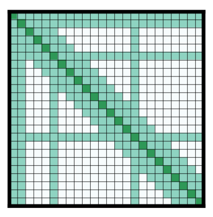

# Architectures Transformer
> Source : [Hugging Face LLM Course — Transformer Architectures](https://huggingface.co/learn/llm-course/en/chapter1/6)

## Modèles à encodeur uniquement

Ces modèles utilisent uniquement l'encodeur du modèle Transformer. À chaque étape, la couche d'attention peut accéder à tous les mots de la séquence d'entrée initiale. Ces modèles sont souvent caractérisés comme ayant une attention "bidirectionnelle", et sont appelés des modèles auto-encodeurs.

Le préentraînement de ces modèles se fait par la prédiction de mots manquants ou cachés dans une séquence fournie.

Les modèles à encodeur uniquement sont adaptés aux tâches qui requièrent une compréhension de toute l'entrée, comme la classification, la reconnaissance d'entités et l'extraction de réponses.

Les représentants de ce type de modèle sont :
* [BERT](https://huggingface.co/docs/transformers/model_doc/bert)
* [DistilBERT](https://huggingface.co/docs/transformers/model_doc/distilbert)
* [ModernBERT](https://huggingface.co/docs/transformers/en/model_doc/modernbert)

## Modèles à décodeur uniquement

Ces modèles utilisent uniquement le décodeur du modèle Transformer. À chaque étape, la couche d'attention peut accéder aux tokens situés avant l'étape actuelle dans la séquence d'entrée initiale. Ces modèles sont souvent appelés des modèles autorégressifs.

Le préentraînement de ces modèles se fait par la prédiction du prochain token d'une séquence.

Ces modèles sont adaptés aux tâches de génération de texte.

Les représentants de ce type de modèle sont :
* [Hugging Face SmolLM Series](https://huggingface.co/HuggingFaceTB/SmolLM2-1.7B-Instruct)
* [Meta's Llama Series](https://huggingface.co/docs/transformers/en/model_doc/llama4)
* [Google's Gemma Series](https://huggingface.co/docs/transformers/main/en/model_doc/gemma3)
* [DeepSeek's V3](https://huggingface.co/deepseek-ai/DeepSeek-V3)

### Grands modèles de langage moderne (LLMs)

La plupart de ces modèles sont des modèles à décodeur uniquement. Ces modèles ont considérablement augmenté en taille et en capacités, certains modèles possédant des centaines de milliards de paramètres.

Les LLMs modernes sont entraînés en deux phases :
1. Préentraînement : Le modèle apprend à prédire le prochain token sur une quantité massive de données textuelles
2. Instruction tuning : Le modèle est *fine-tuné* pour suivre des instructions et produire des réponses adaptées

Cette approche a mené à des modèles capables de comprendre et de générer des textes semblables à ceux produits par des humains sur un large éventail de sujets et de tâches.

#### Principales capacités des LLMs modernes

| Capacité | Description | Exemple |
|------------|-------------|---------|
| Génération de texte | Création de textes cohérents et pertinents par rapport au contexte | Rédaction d'essais, d'histoires ou d'e-mails |
| Résumé | Condensation de longs documents en versions plus courtes | Création de résumés exécutifs de rapports |
| Traduction | Conversion de textes d'une langue à une autre | Traduction de l'anglais vers l'espagnol |
| Réponse aux questions | Fourniture de réponses à des questions factuelles | "Quelle est la capitale de la France ?" |
| Génération de code | Écriture ou complétion de morceaux de code | Création d'une fonction à partir d'une description |
| Raisonnement | Résolution de problèmes étape par étape | Résolution de problèmes mathématiques ou d'énigmes logiques |
| Apprentissage few-shot | Apprentissage à partir de quelques exemples fournis dans le prompt | Classification d'un texte après seulement 2 ou 3 exemples |

## Modèles séquence à séquence

Les modèles à encodeur-décodeur (modèles séquence à séquence) utilisent les deux parties de l'architecture Transformer. À chaque étape, la couche d'attention de l'encodeur peut accéder à tous les tokens de l'entrée initiale, tandis que la couche d'attention du décodeur peut uniquement accéder aux tokens situés avant le token donné en entrée.

Le préentraînement peut prendre plusieurs formes, mais se fait généralement en reconstruisant des phrases dont certaines parties ont été masquées aléatoirement. Le préentraînement du modèle T5 consiste à remplacer aléatoirement des segments de texte, pouvant contenir plusieurs mots, par un unique token spécial de masque et à prédire le texte que ce token remplace.

Les modèles à encodeur-décodeur sont adaptés aux tâches de génération dépendant d'une entrée fournie au modèle, comme le résumé, la traduction ou la génération de réponses à des questions.

### Applications pratiques

| Application | Description | Modèle d'exemple |
|-------------|-------------|---------------|
| Traduction automatique | Conversion de texte d'une langue à une autre | Marian, T5 |
| Résumé de texte | Création de résumés concis à partir de textes plus longs | BART, T5 |
| Génération de texte à partir de données | Conversion de données structurées en langage naturel | T5 |
| Correction grammaticale | Correction des erreurs grammaticales dans un texte | T5 |
| Réponse aux questions | Génération de réponses à partir d'un contexte | BART, T5 |

Les représentants de ce type de modèle sont :
* [BART](https://huggingface.co/docs/transformers/model_doc/bart)
* [mBART](https://huggingface.co/docs/transformers/model_doc/mbart)
* [Marian](https://huggingface.co/docs/transformers/model_doc/marian)
* [T5](https://huggingface.co/docs/transformers/model_doc/t5)

## Choisir le bon modèle

| Tâche | Architecture recommandée | Exemples |
|------|------------------------|----------|
| Classification de texte (sentiment, sujet) | Encodeur | BERT, RoBERTa |
| Génération de texte (écriture créative) | Décodeur | GPT, LLaMA |
| Traduction | Encodeur-Décodeur | T5, BART |
| Résumé | Encodeur-Décodeur | BART, T5 |
| Reconnaissance d'entités nommées | Encodeur | BERT, RoBERTa |
| Réponse extractive aux questions | Encodeur | BERT, RoBERTa |
| Réponse générative aux questions | Encodeur-Décodeur ou Décodeur | T5, GPT |
| IA conversationnelle | Décodeur | GPT, LLaMA |

## Méchanisme d'attention

La plupart des modèles Transformer utilisent l'attention complète, dans le sens où la matrice d'attention est carrée. Cela peut devenir une limite computationnelle lorsque les entrées sont de grande taille. Longformer et Reformer sont des modèles qui cherchent à être plus efficaces face à ce problème en utilisant des versions creuses (sparse) de la matrice d'attention afin d'accélérer l'entraînement.

### Attention LSH

[Reformer](https://huggingface.co/docs/transformers/model_doc/reformer) utilise l'attention LSH. Dans le calcul softmax(QK^t), seuls les plus grands éléments de la matrice QK^t (selon la dimension sur laquelle le softmax est appliqué) vont apporter une contribution réellement utile. Ainsi, pour chaque requête q dans Q, on peut ne considérer que les clés k dans K qui sont proches de q. Une fonction de hachage est utilisée pour déterminer si q et k sont proches. Le masque d'attention est modifié afin de masquer le token courant (sauf à la première position), car celui-ci produit une requête et une clé identiques, et donc très similaires. Comme le hachage peut comporter une certaine part d'aléatoire, plusieurs fonctions de hachage sont utilisées en pratique (leur nombre étant déterminé par un paramètre n_rounds), puis leurs résultats sont moyennés.

### Attention locale

[Longformer](https://huggingface.co/docs/transformers/model_doc/longformer) utilise une attention locale: souvent, le contexte local (par exemple, quels sont les deux tokens situés à gauche et à droite ?) suffit pour traiter un token donné. De plus, en empilant plusieurs couches d'attention utilisant chacune une petite fenêtre, la dernière couche dispose d'un champ réceptif qui dépasse les seuls tokens présents dans sa propre fenêtre, ce qui permet au modèle de construire progressivement une représentation de l'ensemble de la phrase.

Certains tokens d'entrée présélectionnés bénéficient également d'une attention globale : pour ces quelques tokens, la matrice d'attention peut accéder à tous les tokens. Ce mécanisme est symétrique : tous les autres tokens peuvent eux aussi accéder à ces tokens spécifiques, en plus des tokens présents dans leur fenêtre locale. Un exemple de masque d'attention :

L'utilisation de matrices d'attention plus creuses permet ainsi au modèle de traiter des séquences d'entrée plus longues.

### Encodages positionnels axiaux

[**Reformer**](https://huggingface.co/docs/transformers/model_doc/reformer) utilise des encodages positionnels axiaux : dans les modèles Transformer traditionnels, l'encodage positionnel E est une matrice de taille `l` par `d`, où `l` représente la longueur de la séquence et `d` la dimension de l'état caché. Pour des textes très longs, cette matrice peut devenir énorme et occuper beaucoup trop d'espace sur le GPU. Pour réduire ce problème, les encodages positionnels axiaux consistent à factoriser cette grande matrice E en deux matrices plus petites E1 et E2, de dimensions `l1×d1` et `l2×d2`, telles que `l1×l2=l` et `d1+d2=d` (le produit étant utilisé pour les longueurs, la taille totale obtenue est beaucoup plus petite). L'embedding correspondant à l'étape `j` dans E est obtenu en concaténant l'embedding de l'étape `j%l1` dans E1 et celui de l'étape `j//l1` dans E2.